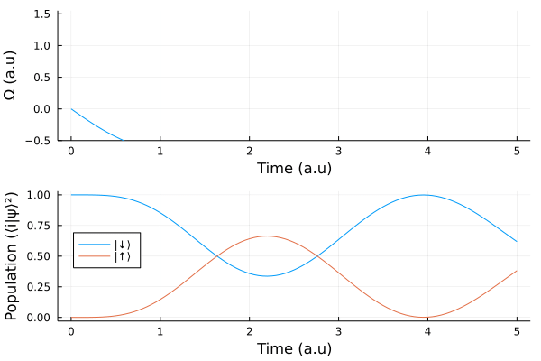

# Sisyphus
`Sisyphus.jl` is a high-performance Julia package for gradient based quantum optimal control. It is well integrated into the Julia ecosystem by supporting definitions of quantum objects from the [QuantumOptics.jl](https://qojulia.org/) library, automatic differentiation through [Flux.jl](https://fluxml.ai/), it relies on [OrdinaryDiffEq.jl](https://github.com/SciML/OrdinaryDiffEq.jl) to simulate the dynamics of quantum systems and can be used in conjunction with any optimizer in the [Flux](https://fluxml.ai/Flux.jl/stable/training/optimisers/) or [NLopt](https://github.com/JuliaOpt/NLopt.jl)[^1] packages. The solver is implemented with the [CommonSolve](https://github.com/SciML/CommonSolve.jl) API. The simulation backend is multi-threaded (uses [MKLSparse](https://github.com/JuliaSparse/MKLSparse.jl) library) and autoscales on multicore CPUs depending on the problem size. It can also be seamlessly run on a GPU and it is suitable for solving large scale quantum optimal control problems.

## Examples

a) optimization of a two level state transfer problem: 

b) optimization of GHZ preparation in a linear chain of 12 atoms on a GPU: 

[^1]: including derivative free optimization algorithms